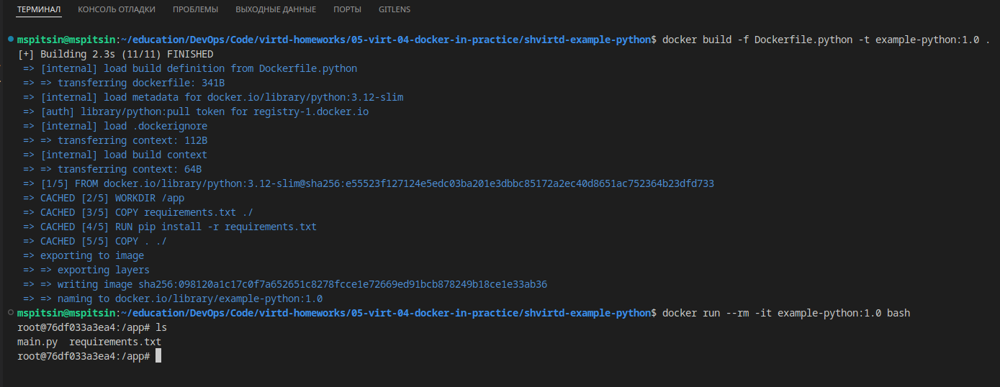
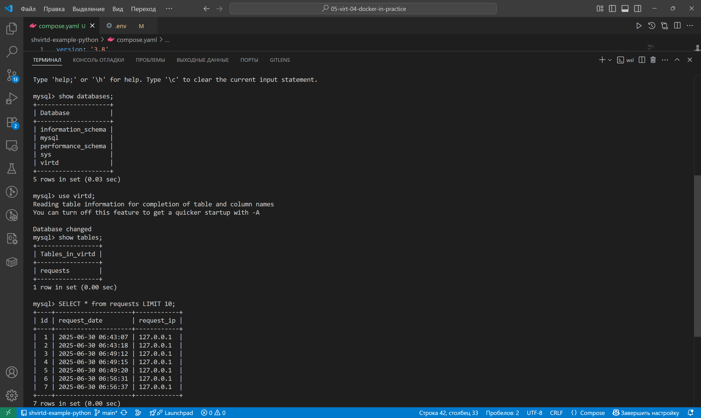
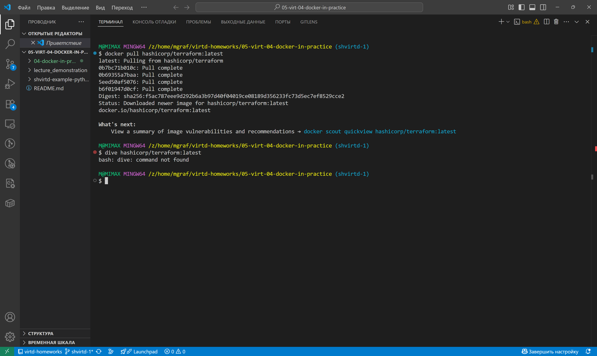
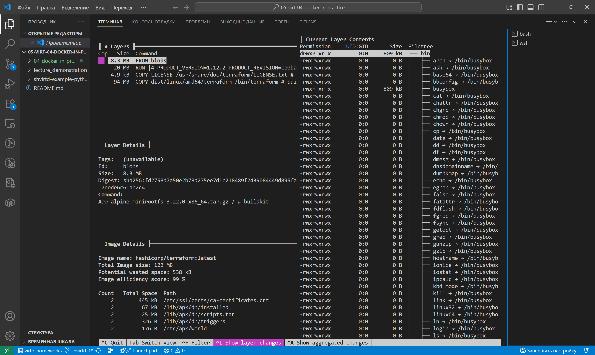
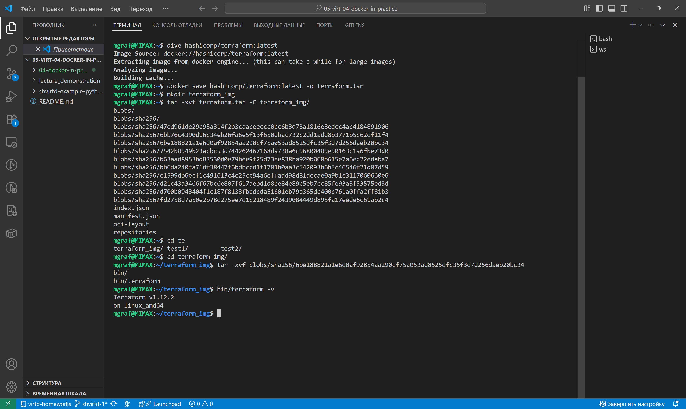

# Домашнее задание к занятию 5. «Практическое применение Docker»  
  
## Решение задачи 1  
  
```Dockerfile.python```
```Dockerfile
FROM python:3.12-slim

WORKDIR /app
COPY requirements.txt ./
RUN pip install -r requirements.txt
COPY . ./

# Запускаем приложение с помощью uvicorn, делая его доступным по сети
CMD ["uvicorn", "main:app", "--host", "0.0.0.0", "--port", "5000"] 
```

```.dockerignore```  
```  
.*
Dockerfile*
LICENSE
README.md
schema.pdf
proxy.yaml
haproxy/
nginx/
```  


## Решение задачи  3
```compose.yaml```
```yaml
include:
  - ./proxy.yaml

services:

  db:
    image: mysql:8
    container_name: db
    restart: on-failure
    env_file: .env
    environment:
      - MYSQL_ROOT_HOST=172.20.0.5
      - MYSQL_ROOT_PASSWORD:${MYSQL_ROOT_PASSWORD}
      - MYSQL_USER:${MYSQL_USER}
      - MYSQL_PASSWORD:${MYSQL_PASSWORD}
      - MYSQL_DATABASE:${MYSQL_DATABASE}
    ports: 
      - '3306:3306'
    networks:
      backend:
        ipv4_address: 172.20.0.10

  web:
    build:
      dockerfile: Dockerfile.python
    container_name: web
    env_file: .env
    restart: on-failure
    environment:
      - DB_HOST=db
      - DB_TABLE=requests
      - DB_USER=${MYSQL_USER}
      - DB_NAME=${MYSQL_DATABASE}
      - DB_PASSWORD=${MYSQL_PASSWORD}
    depends_on:
      - db
    ports:
      - 5000:5000
    networks:
      backend:
        ipv4_address: 172.20.0.5
```
  

## Решение задачи  4  
  


## Решение задачи  6  

Скачайте docker образ `hashicorp/terraform:latest` и скопируйте бинарный файл `/bin/terraform` на свою локальную машину, используя dive и docker save. Предоставьте скриншоты действий.  


  
  

6.1 Добейтесь аналогичного результата, используя `docker cp`.
Предоставьте скриншоты действий.


